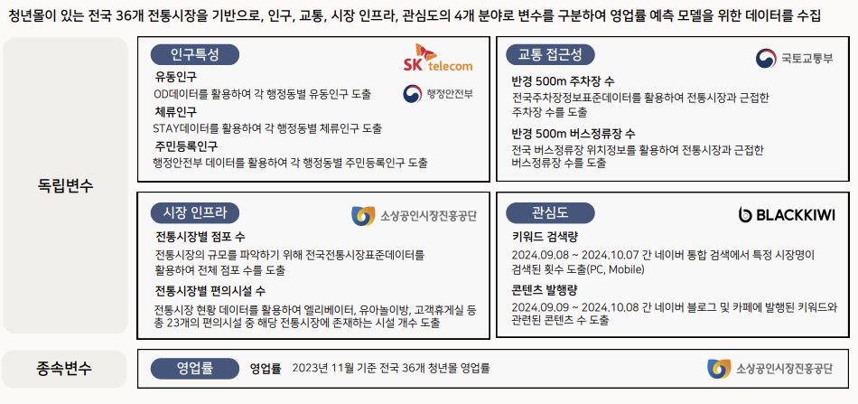
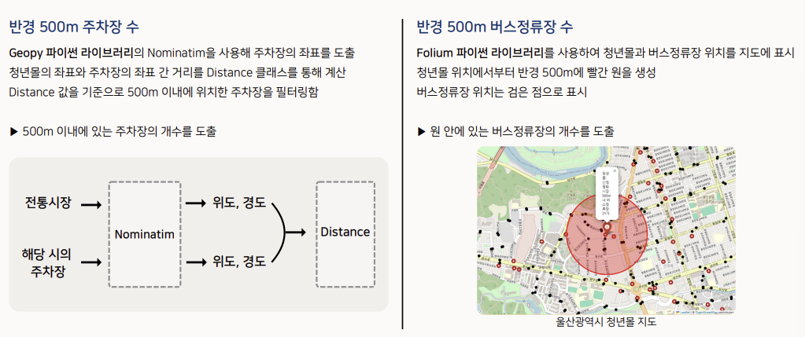
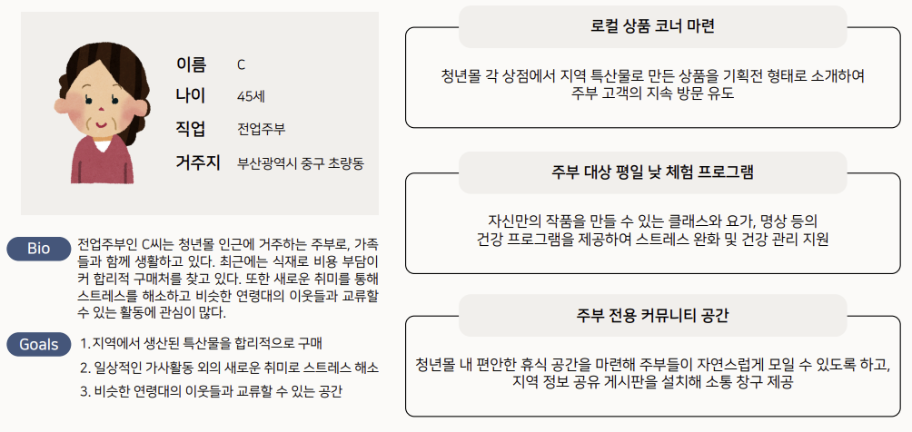

# 🛍️ 빅콘테스트 2024 - 전통시장 활성화: 청년몰 입지 예측 및 운영 전략

📌 **공모전/해커톤 개요**  
본 프로젝트는 **빅콘테스트 2024**에서 진행된 데이터 분석 공모전으로,  
**전통시장 쇠퇴 문제를 해결하기 위한 청년몰의 최적 입지 선정과 OD 데이터 분석 기반의 운영 전략을 제시**하고자 하였습니다.

📌 **발표 자료 및 코드**  
🔗 [발표 자료](https://github.com/HyeyoonKim0711/2024-Bigcontest/blob/main/%EB%B9%85%EC%BD%98%ED%85%8C%EC%8A%A4%ED%8A%B8.pptx.pdf)  
🔗 [코드 저장소](https://github.com/HyeyoonKim0711/2024-Bigcontest/tree/main/Code)

---

## 🎯 공모전/해커톤 정보

- **대회명**: 빅콘테스트 2024
- **주최 기관**: 중소벤처기업부, 한국지능정보사회진흥원(NIA)
- **참가 팀명**: 청년몰티져스
- **수상 여부**: 수상 여부 미정

---

## 👥 참여 인원

4명

---

## ✅ 역할

- OD 및 STAY 데이터 전처리 및 시각화  
- 입지 예측 모델링을 위한 변수 선택  
- 고객 세분화 및 페르소나 정의  

---

## 📊 프로젝트 개요

- **문제 상황**: 청년몰 사업은 입지 선정 실패, 낮은 인지도, 운영 전략 부족으로 다수 폐업
- **목표**:
  - 청년몰의 최적 입지 선정
  - 청년몰 운영 활성화를 위한 맞춤형 전략 제안
  - 유동인구 기반의 홍보 타겟팅 및 시간대별 전략 제시

- **사용 데이터셋**:
  - SKT OD/Stay 데이터
  - 행정안전부 주민등록 인구
  - 전통시장 표준데이터 및 현황 데이터
  - 전국 주차장 / 버스정류장 위치 데이터
  - 키워드 검색량 / 콘텐츠 발행량 (블랙위키)
  - 전국 청년몰 36곳 영업률 (2023.11 기준)
    
---

## 💻 모델 및 기술 스택

- **예측 모델**:
  - XGBoost 기반 영업률 예측 모델
  - Random Forest, Decision Tree와 비교 분석
  - 최종 성능 지표: Normalized MAE

- **데이터 전처리**:
  - 연령(10대~70대 이상), 방문 목적(귀가·여행 목적 등), 방문 시간대 그룹화
  - 교통 접근성, 시장 인프라, 관심도, 인구 특성 기반 변수 생성
    
  - Spearman 상관계수, Feature Importance, Stepwise 등 다양한 변수 선택 기법 적용

- **기술 스택**:
  - Python (pandas, sklearn, xgboost, folium, geopy)
  - Jupyter Notebook

---

## 🛠 분석 과정

### 1️⃣ 입지 예측 모델링

- 실제 청년몰이 있는 전국 36개 전통시장을 기반으로, 인구, 교통, 시장 인프라, 관심도 등의 변수를 이용해 **영업률 예측 모델 구축**
- 2024년 6월 기준 부산광역시 내 230개 전통시장 중 현실적으로 청년몰의 입지로 가능한 전통시장 후보 9곳 선정
  - 시장 내 유효공간 존재(쇠퇴 상권 배제), 점포 수 100개 이상, 운영률 90% 이상, 유통단지 등 특정 목적 전통시장 제외 등
- Spearman 상관계수 및 변수 중요도 기반 상위 10개 변수 선정
- 모델 검증 및 선정을 위해 전체 데이터를 train 9 : test 1로 분리 후 모델링
- 최종 모델: **XGBRegressor** (NMAE 기준)

📍 최종 선정된 청년몰 입지: **부산 초량전통시장 (예측 영업률 68.6%)**

---

### 2️⃣ 광고 및 관광 콘텐츠 전략 및 인사이트 도출

- 부산역(초량3동)과 초량시장(초량2동)의 체류인구 유사성 분석
- **부산역 광고판을 활용한 타겟 마케팅 제안**  
  - 🎯 타겟: 20-30대, 40-50대  
  - ⏰ 시간대: 17:00~18:30, 18:30~19:00
- 예산에 따른 최적 광고 시나리오 도출
  

- 체류인구 분석을 통해 여행/쇼핑여가 목적의 관광객이 많은 **초량2동의 주말과 저녁 시간대에 청년몰 주말 야시장 운영 제안**
  - 👩‍👧‍👦 귀가하는 주민, 업무/학업 목적의 체류인구에 관광객을 더해 시장의 활성화 도모
  - 🌆 초량 2동으로 유입된 유동인구 분석을 통해 인근 지역의 야경 명소와 연계
  

---

### 3️⃣ 클러스터링 기반 페르소나 분석

- OD 데이터 기반 고객 세분화 (K-Means 클러스터링)
  - 거리, 시간대, 연령, 주말 여부 등 변수 기반 클러스터링
  
- 주요 고객군 3개 도출 및 대표 페르소나 설계

📌 **예시 페르소나**:
- A씨 (서울 거주 20대 여행객): 주말 저녁 방문, SNS 공유
- B씨 (부산 직장인): 퇴근 후 야시장 및 할인 타겟
- C씨 (초량 거주 주부): 지역 커뮤니티 기반 체험 프로그램 대상
  

---

## 📈 주요 성과

- 청년몰 입지 예측 모델 정확도 향상 (NMAE 기준 성능 확보)
- 시간대 및 타겟 연령대 기반 광고 전략 수립
- 체류 목적 분석 기반 주말 야시장 운영 제안
- 클러스터링을 통한 고객군 유형별 맞춤 운영 전략 제시

---

## 🚀 적용 가능성

- **정책 활용**: 지역 기반 청년몰 사업 신규 조성 시 활용 가능
- **지자체**: 관광/상권 활성화를 위한 데이터 기반 의사결정 도구
- **마케팅**: 유동인구 기반 타겟 광고, 시간대별 프로모션 설계

---

## ✍️ 분석 의의

- 다양한 공공 데이터를 결합하여 **정량적 입지 선정 모델 구현**
- 정성적 전략 (야시장, 페르소나 기반 마케팅)과 **정량 모델의 융합**
- **청년 창업자 지원 정책** 및 **지역 경제 활성화**에 기여할 수 있는 실무형 프로젝트 수행 경험
